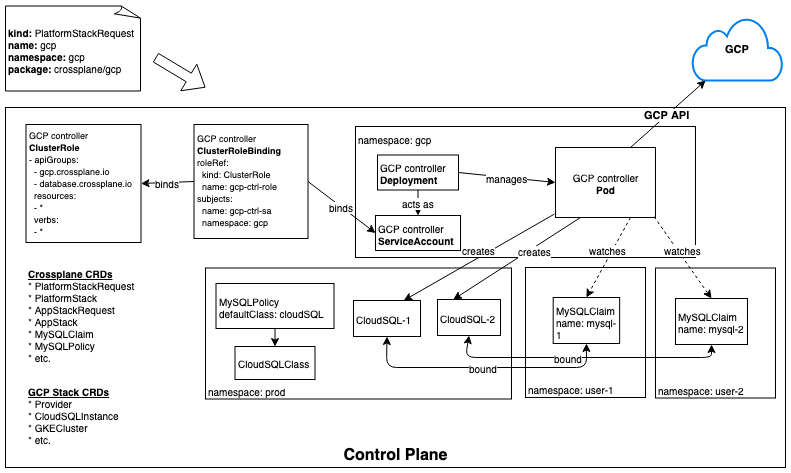
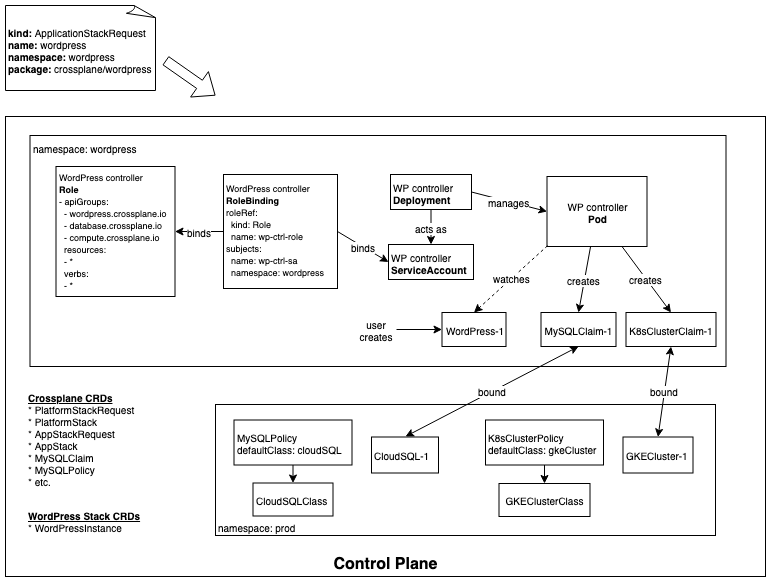

# Stacks Security and Isolation

* Owner: Jared Watts (@jbw976)
* Reviewers: Crossplane Maintainers
* Status: Draft, revision 1.0

## Background

The current model for extending Crossplane with new functionality is scoped to a single type that is used in all scenarios and by all personas.
All new types of functionality, from an end user wanting to install a simple application to an administrator wanting to install support for low level infrastructure types, are all treated the same.
They have the same approach to security and access control and the artifacts that they install have the same scope of impact to the control plane.

This one size fits all approach is not ideal though, the multiple scenarios and personas need finer grain control around security, access, and isolation.
This design doc proposes a new approach for the Crossplane Stack Manager (SM) that will support this increased control for the installation of stacks.

## Personas and Scenarios

There are many different scenarios and types of users that may want to install new functionality into their control plane.
This design proposes support for two high level personas/scenarios as an effective starting point.

* **Platform:** An administrator of the control plane that is installing wide ranging support for lower level infrastructure and platform components,
such as installing support for an entire cloud provider and all of its infrastructure and platform services.
  * An example of this would be the `GCP` stack that contains a `Network` primitive and the `CloudSQL` resource.
This persona would also be expected to define resource classes and other environment specific details.
* **Application:** An application operator or end user of Crossplane.
They are focused at a higher level and want to install the functionality of a single application, such as `GitLab` or `WordPress`.
This persona is not expected to know or control any details about the environments managed by the Crossplane cluster, they simply need to consume their new application of choice.

## Design Summary

The key difference in how the supported personas/scenarios will be handled is in the **scope** of the permissions that they are granted within the control plane.

* **Platform stacks** will be given permissions to watch, access, and create resources at a **cluster level**, i.e. across **all namespaces**.
* **Application stacks** will be given permissions only within a **single namespace**.

This means that application stacks should not be able to directly affect any resources outside of the specific namespace they are installed into, while platform stacks operate at a higher level of privilege and can affect the entire cluster.

### CRD Scoping

To avoid a common point of confusion, let's review the available scoping of CRDs.
Custom resource **instances** can be scoped to either a single namespace or to the entire cluster.
It's important to note that this refers to the instances, not the CRD type definitions.
From the [Kubernetes documentation](https://kubernetes.io/docs/tasks/access-kubernetes-api/custom-resources/custom-resource-definitions/#create-a-customresourcedefinition):

> CustomResourceDefinitions themselves are non-namespaced and are available to all namespaces

Therefore, any time a CRD is created, it will also be at the cluster scope, even if instances of the CRD are scoped to a namespace.
This has caused confusion in the past, so it's important to clear that up here.

## Platform Stacks

Platform Stacks can be thought of as a higher level of privilege than other types of stacks, similar to how kernel modules work in Linux.
The controllers contained in a platform stack will usually reconcile resources that are external to the cluster, for example cloud provider managed services.
These controllers will also likely be written as full fledged controller-runtime based implementations, but that is not a requirement.

Let's look at a specific example of the GCP platform stack to understand the security and isolation model more thoroughly.
When the Stack Manager installs the GCP stack, a few things will happen:

* All CRDs related to GCP infrastructure and services will be installed to the cluster, such as `CloudSQLInstance`, `CloudSQLInstanceClass`, `GKECluster`, `GKEClusterClass`, `Network`, `Subnetwork`, etc.
* A `ClusterRole` will be created at the cluster level that includes all of the RBAC rules for API groups, resources, and verbs that were specified in the `rbac.yaml` file from the stack.
Because this is a `ClusterRole`, bindings to this role can grant the given permissions to cluster-scoped resources and to namespaced resources across all namespaces.
* A `ServiceAccount` is created in the namespace that the stack's controller will be running.  This will serve as the runtime identify of the controller.
* A `ClusterRoleBinding` is created at the cluster level to bind the `ClusterRole` and the namespaced `ServiceAccount`
* A `Deployment` is created in the same namespace as the stack and it is expected to launch and manage the pod that hosts the GCP controllers.

It is worth reiterating the scope of permissions that this platform stack has received:

> Because the stack is given a `ClusterRole`, it can be granted permissions to cluster-scoped resources and to namespaced resources across all namespaces.

The diagram below summarizes the artifacts in the control plane after the GCP stack has been installed and a couple example `MySQLClaims` have been created.

### Environments

While platform stacks are installed at the cluster level (there is only one instance of each platform stack), they can still support the concept of multiple "environments", each represented by a namespace.
For example, an admin can create a namespace to model their production "environment" and another namespace to model their development "environment".
All resources within each of those environments can share a common set of provider credentials.
This namespaced "environment" approach provides the administrator with a way to collect or aggregate all the infrastructure and services associated with a given environment.

#### Platform Stack Single Instance Version Limitation

One caveat of this approach is that because there is only a single instance of the platform stack in the cluster, it is therefore shared across all environments.
This means that all environments must use the same version of the stack.
If an admin wants to try a newer version of the stack for their dev environment, it will also result in the newer version of the stack being used in the production environment as well.

This limitation could be addressed in the future by allowing multiple versions of platform stacks installed per control plane, which would require additional complexity and design work.
To get started, we will make the simplifying constraint that only a single version of a platform stack can be installed and it will be shared across all namespaces (environments).

#### Environment Policies

Another potential advantage of supporting multiple namespace "environments" is that each one could be assigned their own specific policy, such as default resource classes.
The production environment could have a completely different set of default resource classes than the development environment.
Since these environments are simply represented by namespaces, they can take on any arbitrary meaning or scope.
For example, instead of dev vs. prod, they could represent entirely other dimensions, such as a high performance environment, a cheap environment, an AWS only environment, etc.

The full design for this support of different policies per environment is out of scope of this document, but this idea has interesting potential.

## Application Stacks

Application stacks are expected to represent higher level "application" functionality.
Instead of providing the infrastructure and lower level platform components for entire environments like a platform stack, they merely provide the functionality to support a single application.
It is expected for application stacks to (indirectly) consume and build on functionality from platform stacks in the form of resource claims.
For example, an application stack could generate a `MySQLClaim` that is fulfilled through a default resource class by a platform stack in the form of a concrete MySQL database instance.

The key aspect of an application stack is that it will be installed with permissions to only watch for resources within the namespace it is running in.
This provides a nice isolation as well as versioning story.

* **Isolation:** The application stack should not be able to read or write any resources outside of its target namespace.
* **Versioning:** Multiple versions of the stack can be installed within the control plane, each namespace can have their own independent version.

Let's look at a concrete example of what happens when the `WordPress` application stack is installed into Crossplane in a target namespace of the user's choice:

* All CRDs defined by the WordPress stack will be installed into the cluster (remember that CRDs themselves are always cluster scoped).
In the case of WordPress, a single CRD is installed that represents a WordPress application instance, `WordPress`.
* A `Role` will be created in the target namespace that includes all of the RBAC rules for API groups, resources, and verbs that were specified in the `rbac.yaml` file from the stack.
Because this is a `Role`, this only grants the given permissions to namespaced resources in the target namespace.
* A `ServiceAccount` is created in the namespace that the stack's controller will be running that will serve as the runtime identify of the controller.
* A `RoleBinding` is created in the target namespace to bind the namespaced `Role` and the namespaced `ServiceAccount`.
* A `Deployment` is created in the same namespace as the stack and it is expected to launch and manage the pod that hosts the WordPress controller.

The diagram below summarizes the artifacts in the control plane after the WordPress stack has been installed and an example `WordPressInstance` custom resource has been created.
The diagram shows the result of the following sequence of actions:

1. The user creates an `ApplicationStackRequest` and specifies the WordPress stack
1. The Stack Manager installs the CRDs defined in the stack, creates the necessary RBAC primitives, and starts up the WordPress controller in the same namespace as the stack.
1. The user creates an instance of the `WordPressInstance` custom resource in the same namespace.
1. The WordPress controller is watching for events on this CRD type in the namespace it is running in.
1. In response to seeing the creation event for this `WordPressInstance` custom resource, the WordPress controller creates claims for the services that the instance will need, such as a MySQL database and a Kubernetes cluster.
1. These claims are then serviced by the default resource classes in the environment that point to specific provisioners that were previously installed as part of a platform stack.

This flow demonstrates how an application stack indirectly consumes a platform stack and is represented in the diagram below:

## TODO

* Incorporate remaining raw notes
